<h1>Shell basics</h1>


# Task 0
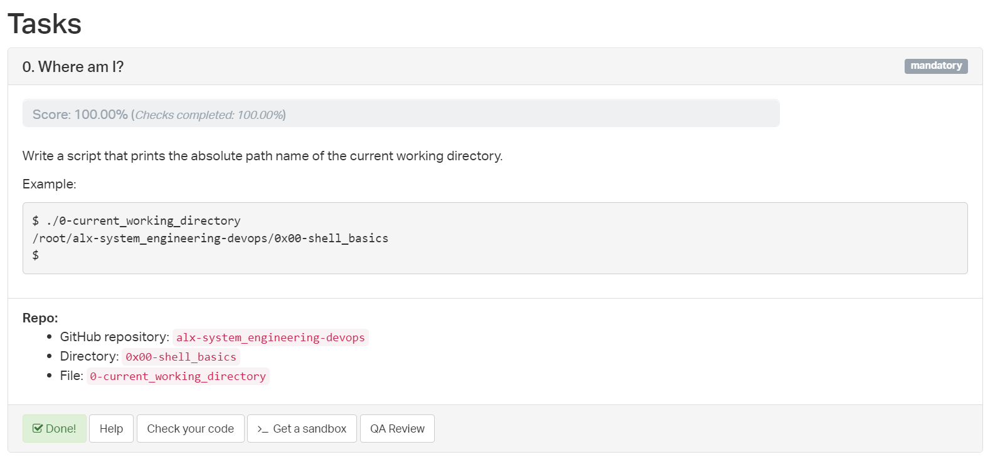

```bash
#!/bin/bash
pwd
```

# Task 1
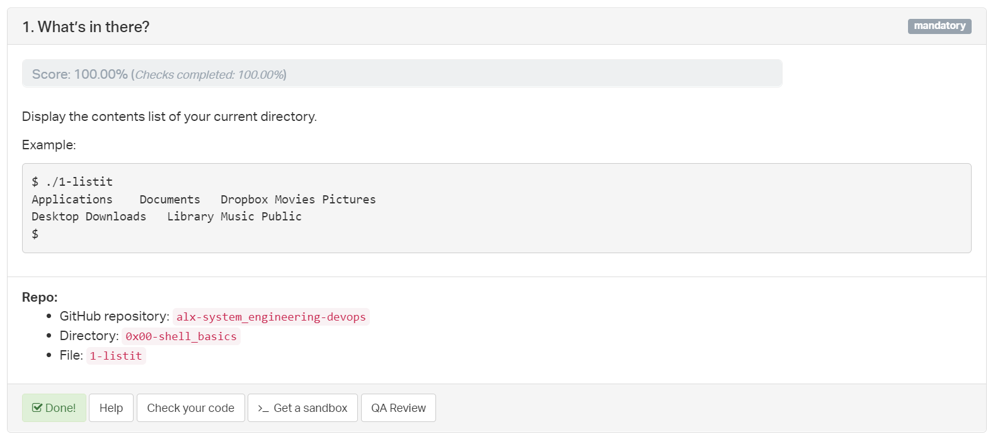

```bash
#!/bin/bash
ls
```

# Task 2
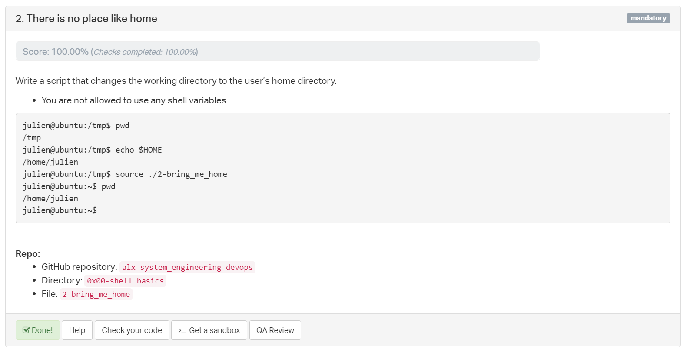

```bash
#!/bin/bash
cd ~
```

# Task 3
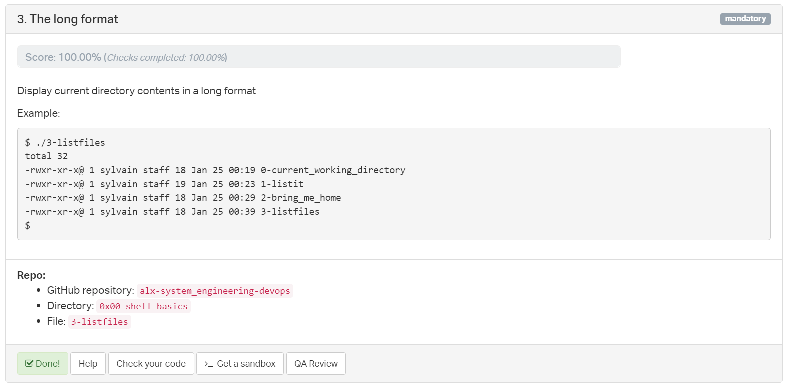

```bash
#!/bin/bash
ls -l
```

# Task 4


```bash
#!/bin/bash
ls -la
```

# Task 5
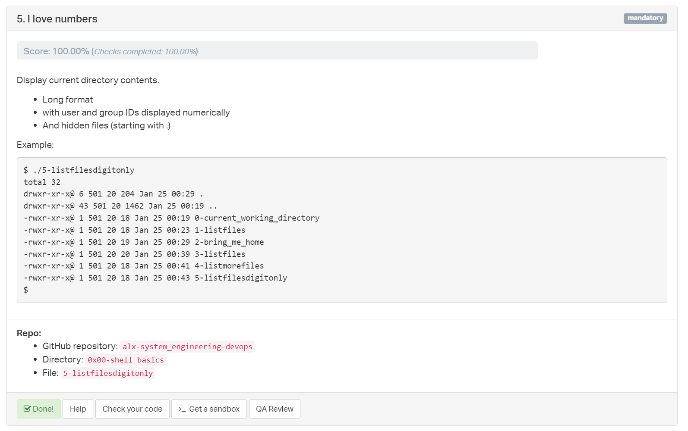

```bash
#!/bin/bash
ls -na
```

# Task 6
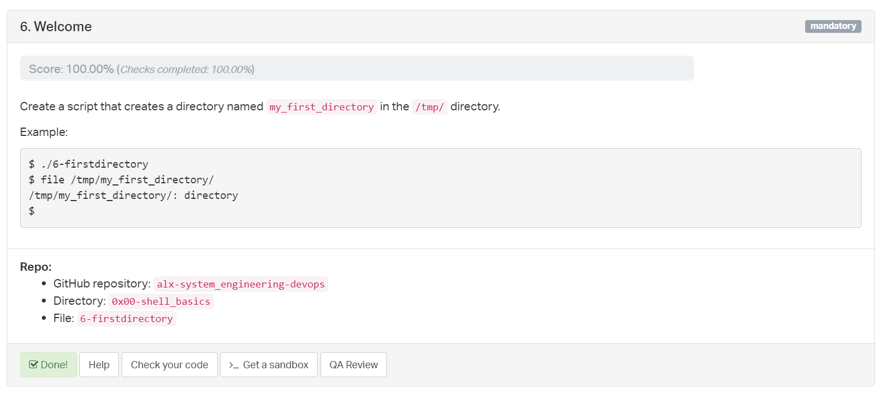

```bash
#!/bin/bash
mkdir /tmp/my_first_directory
```

# Task 7
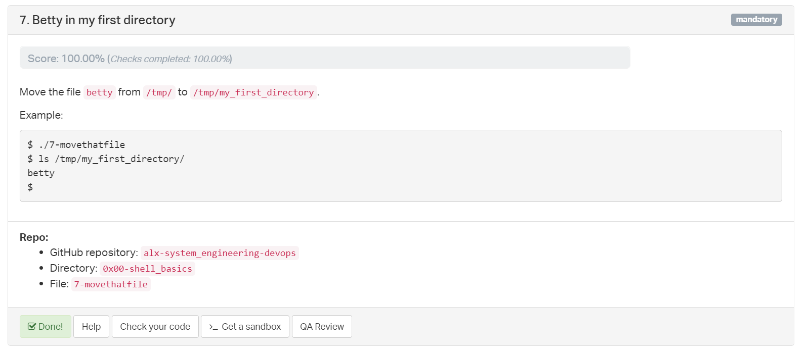

```bash
#!/bin/bash
mv /tmp/betty /tmp/my_first_directory/
```

# Task 8
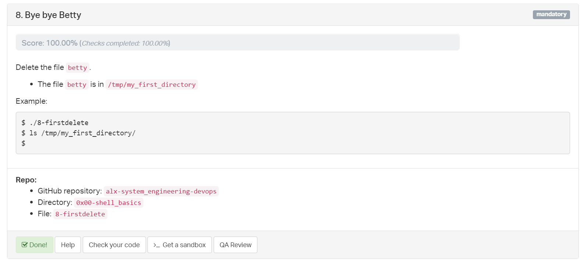

```bash
#!/bin/bash
rm /tmp/my_first_directory/betty
```

# Task 9
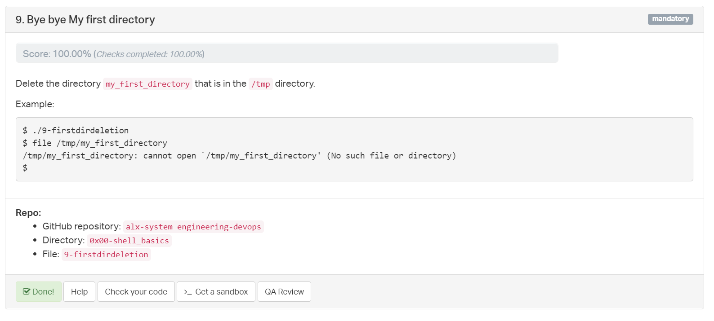

```bash
#!/bin/bash
rmdir /tmp/my_first_directory
```

# Task 10
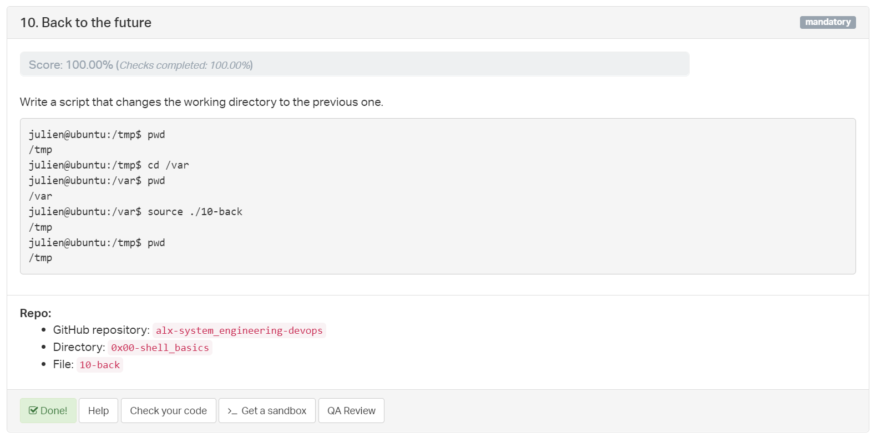

```bash
#!/bin/bash
cd -
```

# Task 11
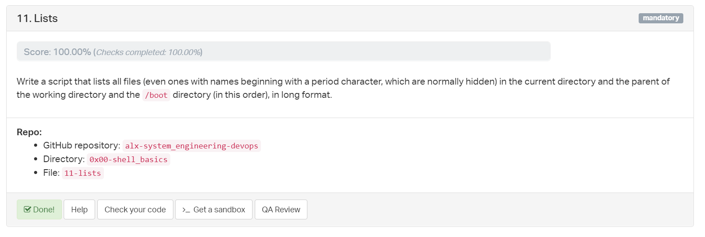

```bash
#!/bin/bash
ls -la . .. /boot
```

# Task 12
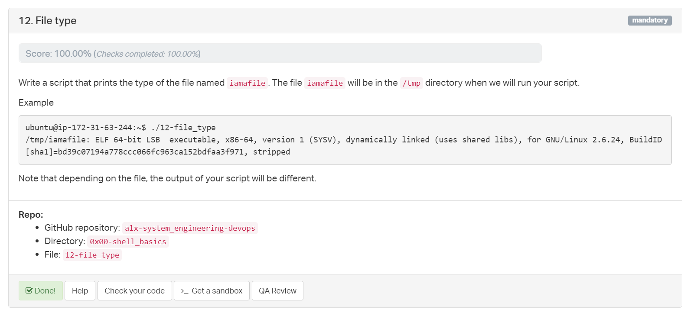

```bash
#!/bin/bash
file /tmp/iamafile
```

# Task 13
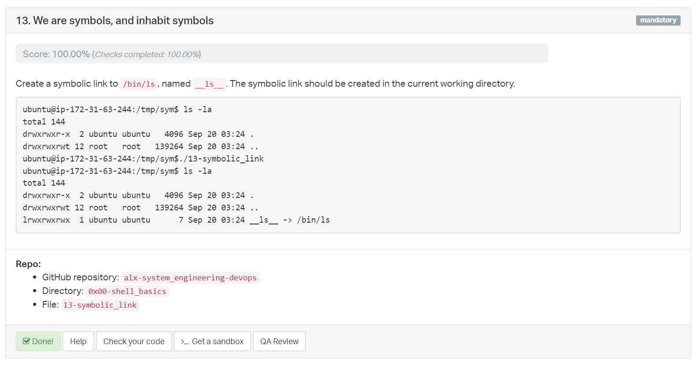

```bash
#!/bin/bash
ln -s -T /bin/ls __ls__
```

# Task 14
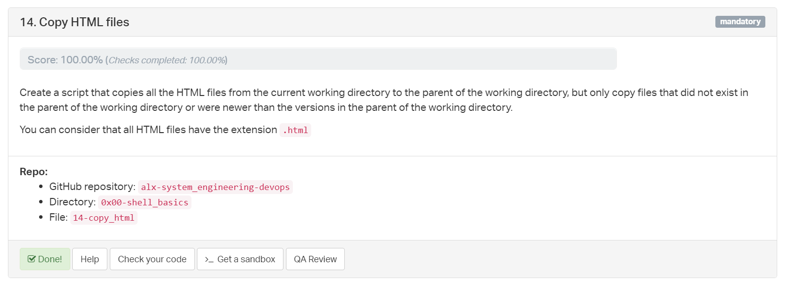

```bash
#!/bin/bash
cp -u *.html ..
```

# Task 15
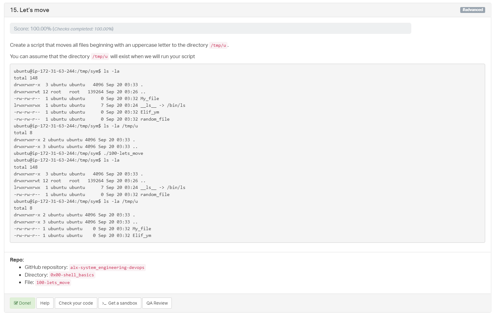

```bash
#!/bin/bash
mv [A-Z]* /tmp/u/
```

# Task 16
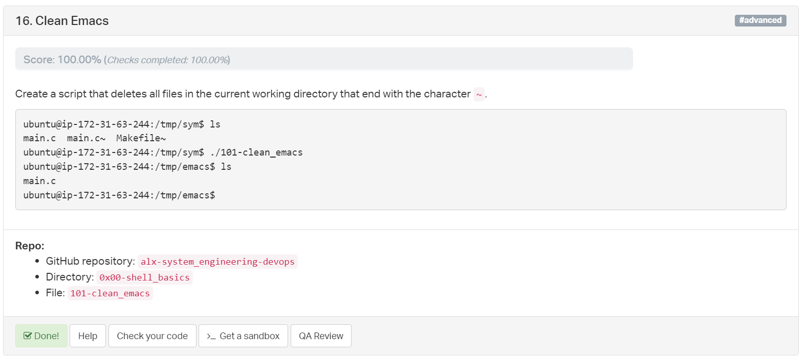

```bash
#!/bin/bash
rm *~
```

# Task 17
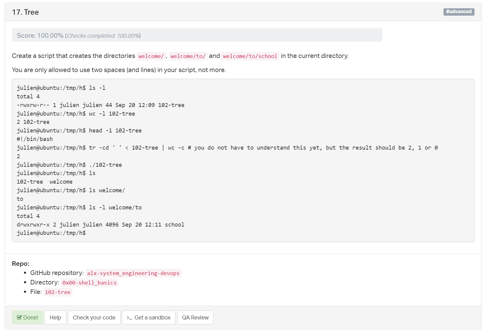

```bash
#!/bin/bash
mkdir -p welcome/to/school
```

# Task 18
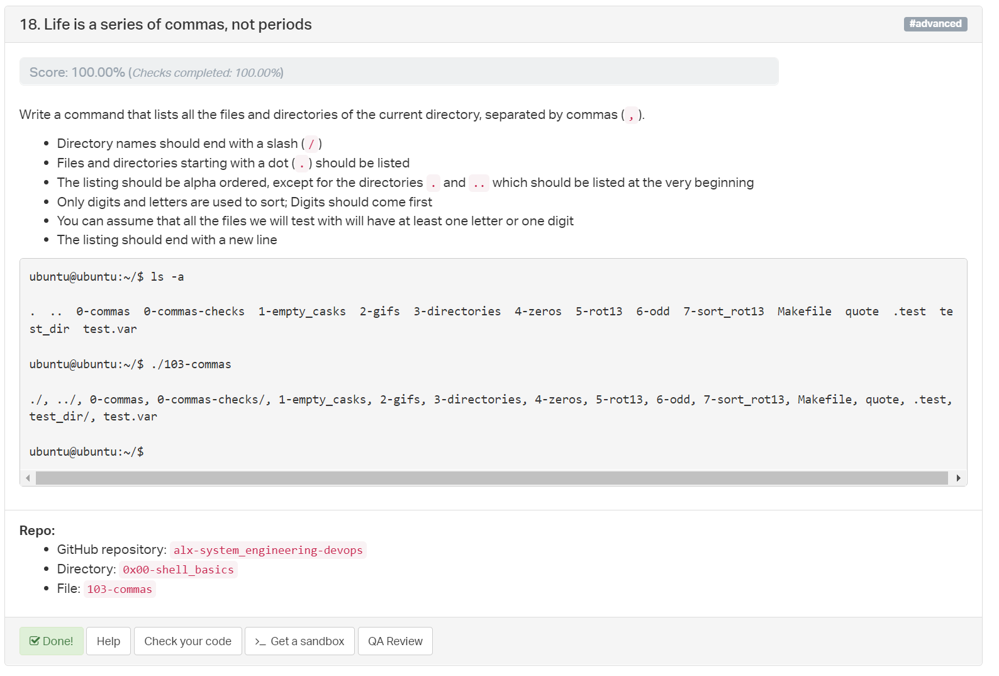

```bash
#!/bin/bash
ls -a -m --file-type
```

# Task 19
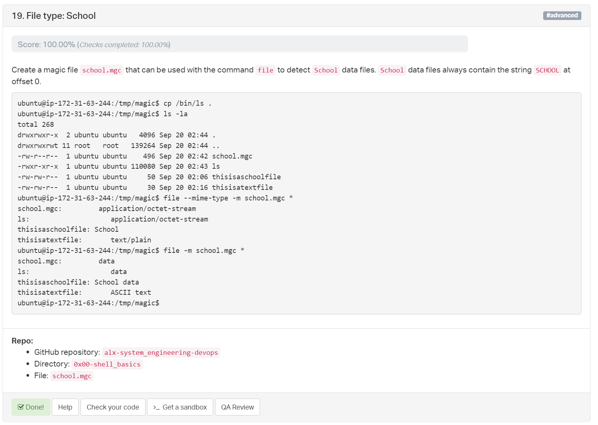

```magic
0	string	SCHOOL	School data
!:mime	School
```


